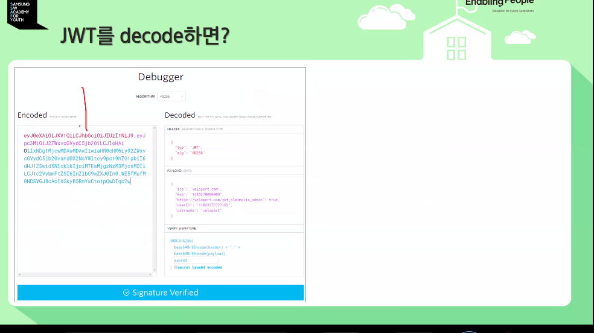
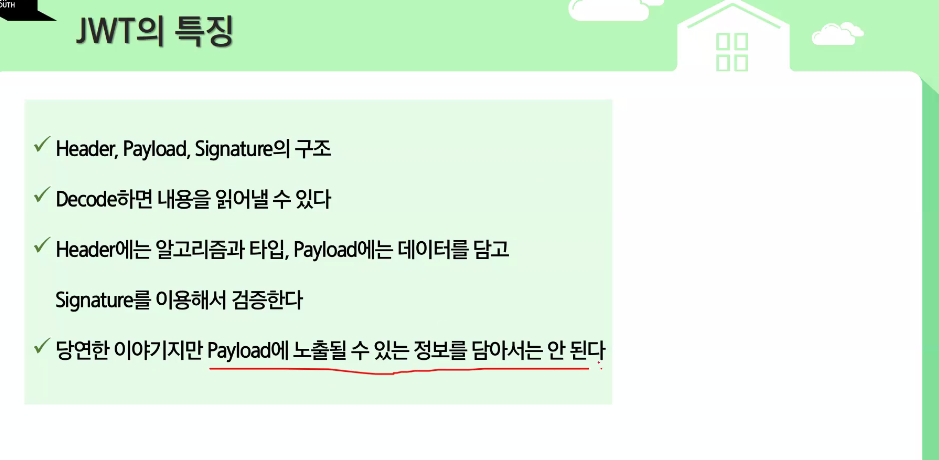
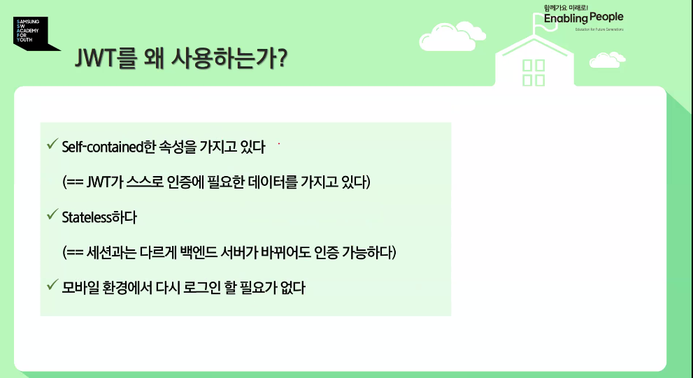
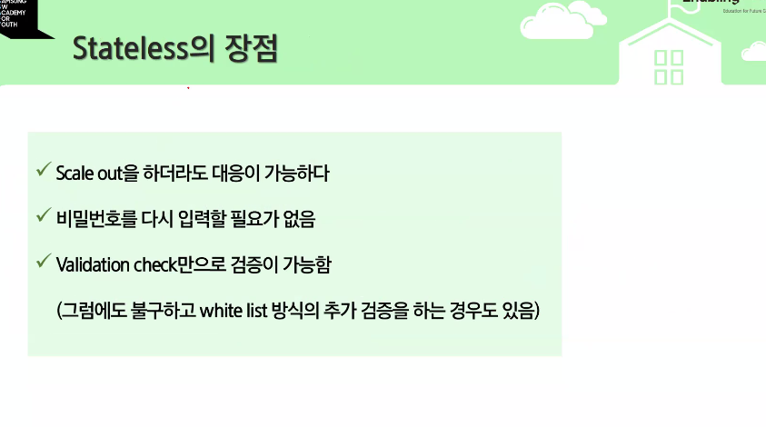
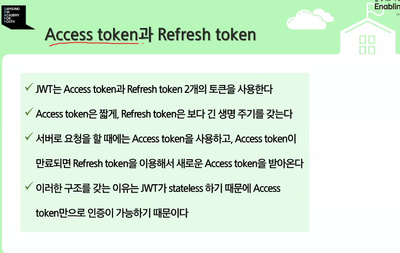
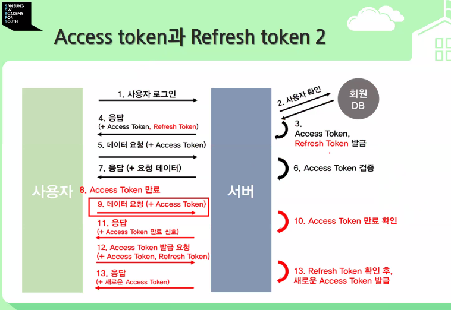
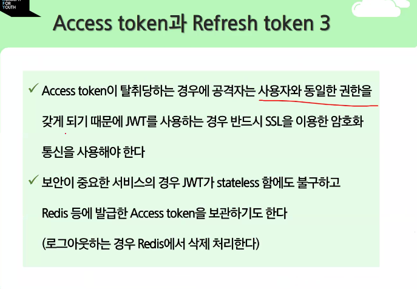

헤더 시그니처 등이 어떤 것을 담고 있는지 알아야함다.
JWT는 디코드가 가능하다.

안에 페이로드로 다 볼 수 있다.
그래서 개인정보를 담아서 다녀서는 안된다.
반드시 TLS를 적용한 상태에서 JWT를 적용해야한다.
이것 자체로 인증이 가능하다. HTTP로 보내는 것은 해킹에 무방비

유저가 쏟아져 들어올 때, 

토큰 자체만으로 인증이 가능하기에 위험하다 그래서 리프레쉬 토큰을 사용해서 생명주기를 늘린다.

짧게와 길게는 굉장히 주관적이고 서비스마다 다르다.

리플레쉬가 만료된다면 원칙은 로그인을 다시 시키는 것이 원칙임

탈취에 성공하면 공격자는 완전히 같은 권한을 갖게된다.

보안이 중요한 서비스는 레디스 같은 것을 써서 화이트리스트 방식을 사용하기도 함

---
키워드 한가지를 쓸 것이라면 그걸 이런식으로 정리해야한다.

첫번째
1. 디렉토리 구조를 도메인
2. JPA 빌더 패턴
- 불변성을 유지하고 가독성 및 유지보수성을 향상 시켰음
- SQL 중심 개발에서 서비스 중심 개발로 바꾸기 위해
	-> 데이터베이스 종류에 대해 독립적이라는 것도 서비스 중심 개발로 이을 수 있다.
3. MVC 구조로 프로그래밍

"생산성을 어떻게 높였는가에 대한 질문"
어떤 생산성을
"프로그램은 마이바티스가 빠르긴 하지 않는가."
"n+1 문제는 어떻게 해결하였는가" -> 엔티티 그래프로 패치 조인이랑

두번째
1. SpringWebClient
2. Docker를 사용함
3. 데이터베이스를 도커별로 다 분리했음. JPA 트랜잭션을 잘 사용했다.
=> 그렇게해서 데드락 문제를 해결했다.
4. 데이터 무결성 -> 역정규화를 통해 테이블을 전부다 읽어서 돈을 얼마큼 남았는지 계산하는데 이 과정에서 무결성이 깨질 수 있으니, 미리 계산해놓지 않고, 속도보다는 데이터의 무결성에 초점을 두었다.

경험
처음에는 제스처 상태를 전달하기 위해서 매 프레임마다 보내고 이걸 별로 시간 변수를 잡아서 설정하였으나, 이걸 코루틴을 사용해서 비동기할때 사용하는 이걸로 1초 단위로 정보를 전달한다.
유니티에서 setinterval 대신에서 사용하는 것임

1. 개발 환경을 통일한다.
도커로 개발할때 원래는 프로ㄷ거트 도커와 개발용 도커 두개를 분리해서하는게 원칙이다.
개발하고 테스트한 도커를 근데 자주 그냥 쓴다.
어쨌든, 개발 환경을 통일할 수 있다. 라이브러리도 별도로 설치하지 않아도 되고, 도커 내에 서버를 구성하여 Ec2
도커를 사용함으로서 Ec2에서 환경 세팅을 할 필요 없다.
