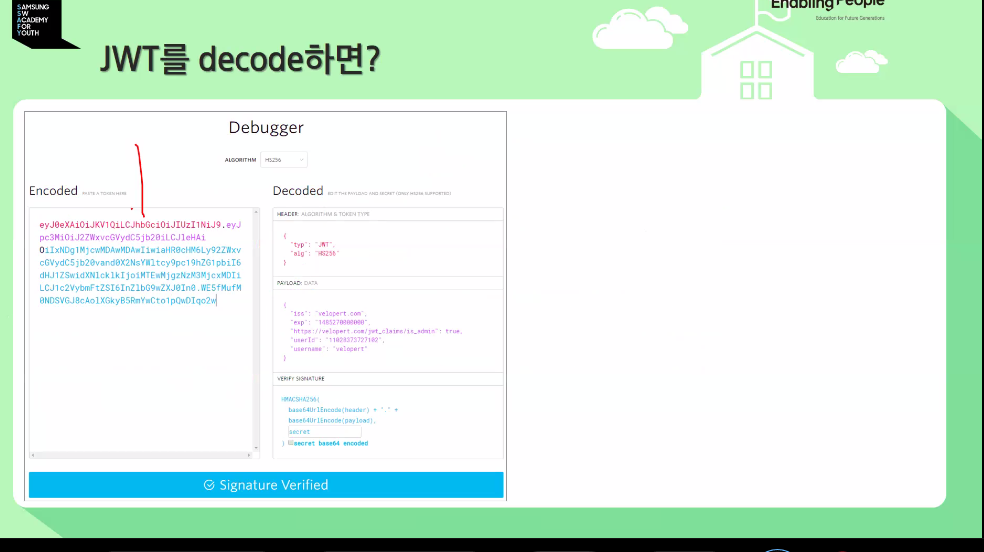
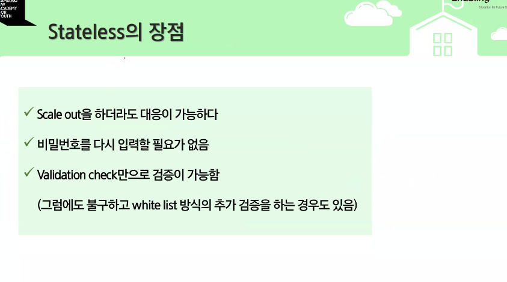

헤더 시그니처 등이 어떤 것을 담고 있는지 알아야함다.
JWT는 디코드가 가능하다.

안에 페이로드로 다 볼 수 있다.
그래서 개인정보를 담아서 다녀서는 안된다.
반드시 TLS를 적용한 상태에서 JWT를 적용해야한다.
이것 자체로 인증이 가능하다. HTTP로 보내는 것은 해킹에 무방비

유저가 쏟아져 들어올 때, 

토큰 자체만으로 인증이 가능하기에 위험하다 그래서 리프레쉬 토큰을 사용해서 생명주기를 늘린다.

짧게와 길게는 굉장히 주관적이고 서비스마다 다르다.

리플레쉬가 만료된다면 원칙은 로그인을 다시 시키는 것이 원칙임

탈취에 성공하면 공격자는 완전히 같은 권한을 갖게된다.

보안이 중요한 서비스는 레디스 같은 것을 써서 화이트리스트 방식을 사용하기도 함

---
키워드 한가지를 쓸 것이라면 그걸 이런식으로 정리해야한다.

ㅇ
