개발 환경을 통일한다.
도커로 개발할때 원래는 프로ㄷ거트 도커와 개발용 도커 두개를 분리해서하는게 원칙이다.
개발하고 테스트한 도커를 근데 자주 그냥 쓴다.
어쨌든, 개발 환경을 통일할 수 있다. 라이브러리도 별도로 설치하지 않아도 되고, 도커 내에 서버를 구성하여 Ec2
도커를 사용함으로서 Ec2에서 환경 세팅을 할 필요 없다.

---
아침 수업
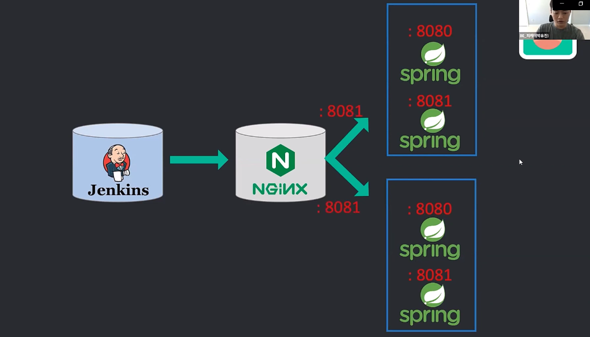

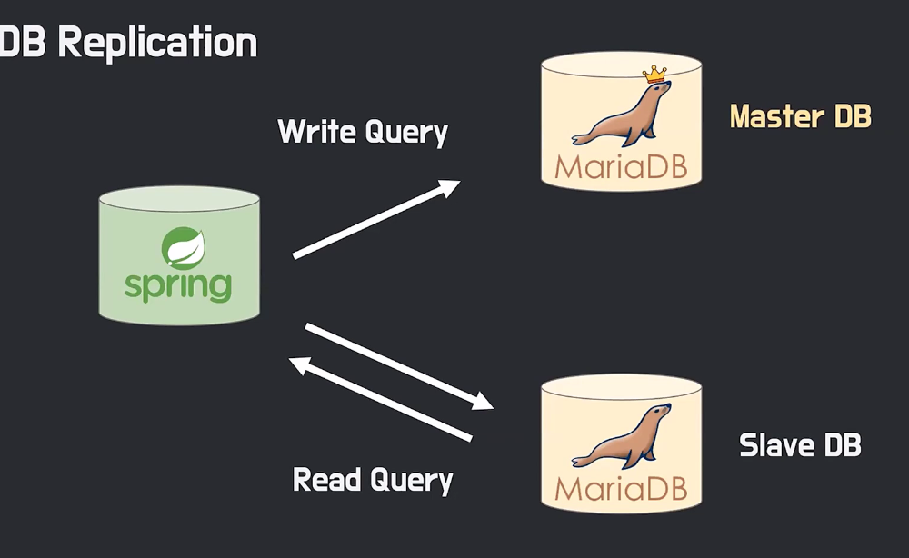

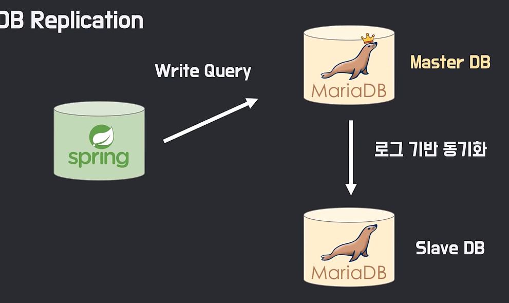

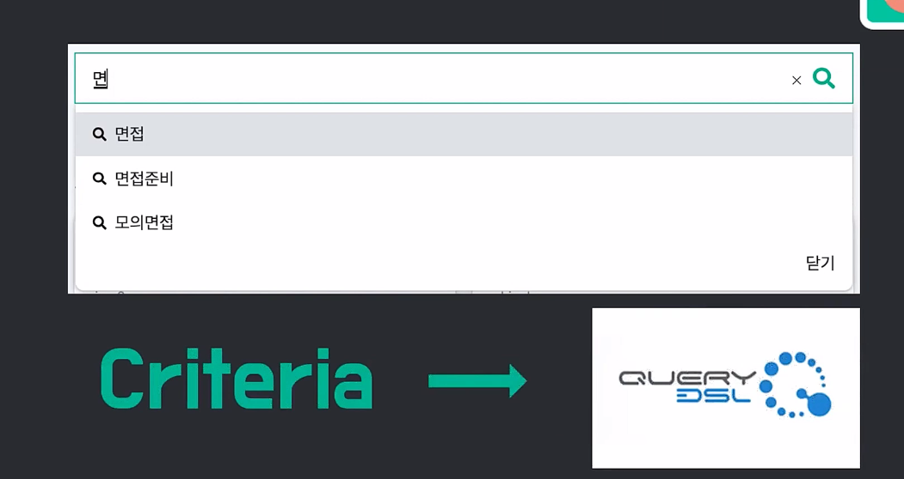

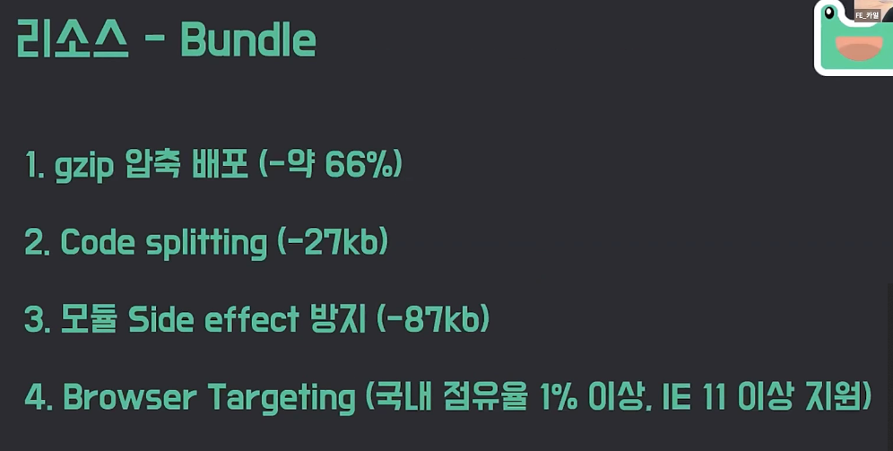

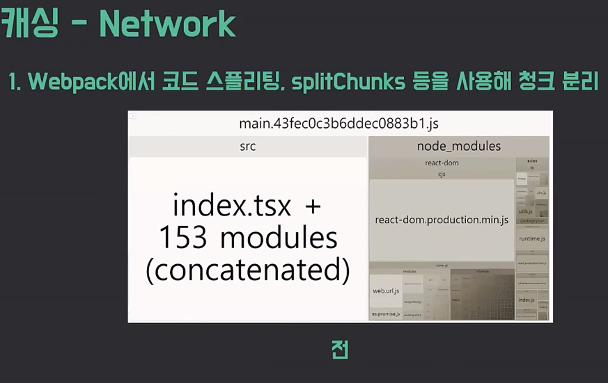

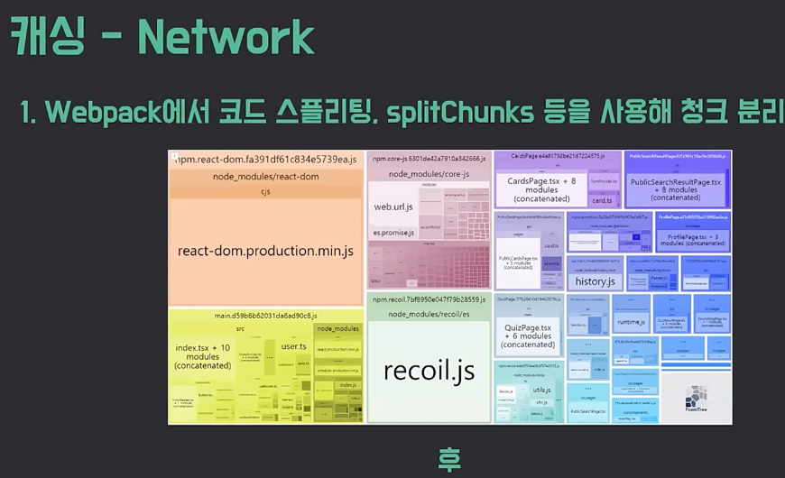

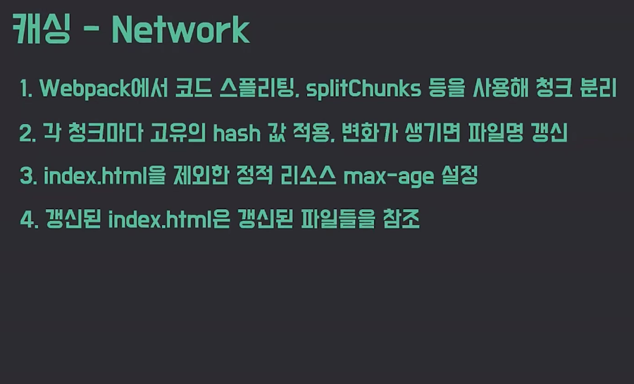

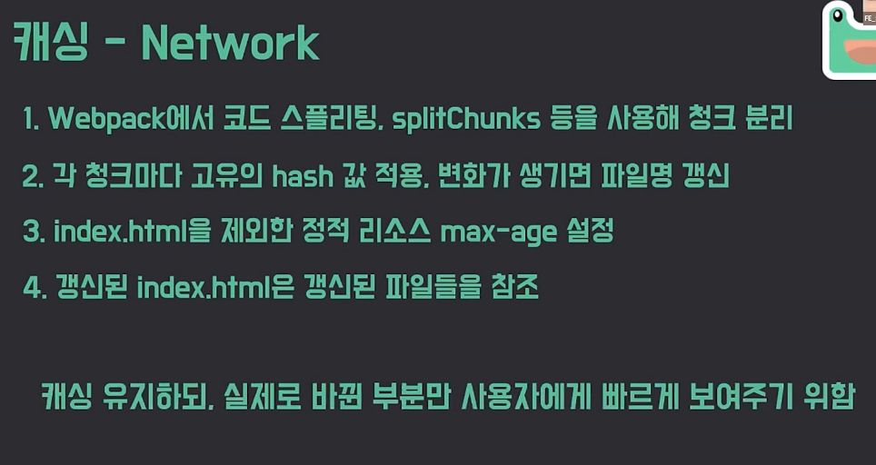

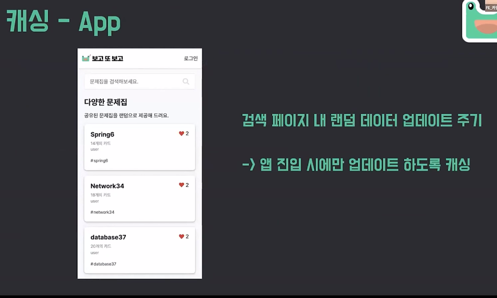

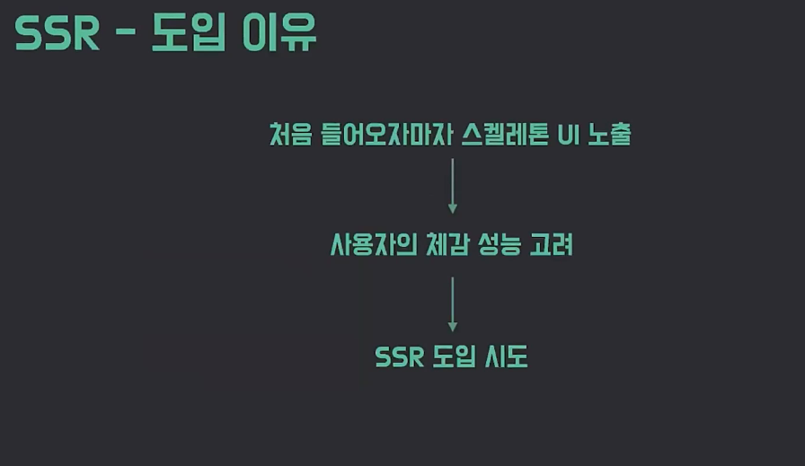

전 후로 어떤 것이 달라졌는지가 있어야한다.
                                                                                    