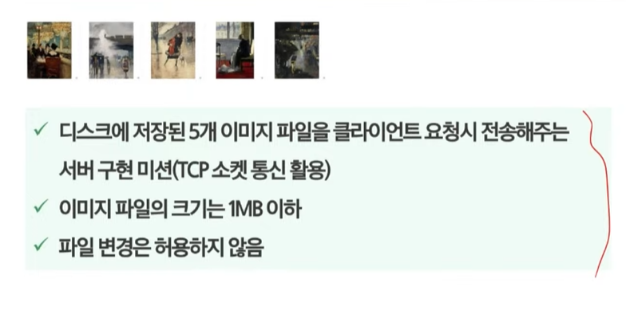

지금 문제가 mediapipe에서 측정하는 값을 피유한테 전달하는게 문제였음
처음에는 프레임 단위로 상태를 변경해서 전달했는데, 그러니까 받아서 점수를 계산하는 부분에서 점수가 너무 많이 달라진다.
그래서 2초에 한번씩 보내는 것으로 변경
그렇게 변경해도 받는 곳에서는 프레임 단위로 가져오기 때문에 계속해서 f
비즈니스 로직이 약간 분리가 안되는 것 같기는 하다