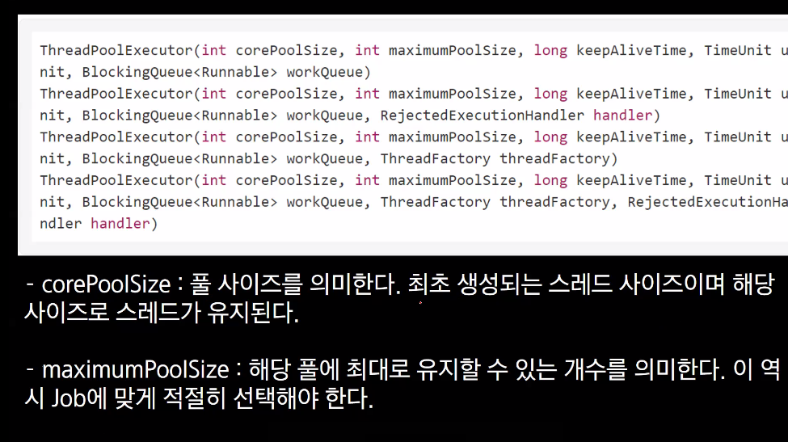
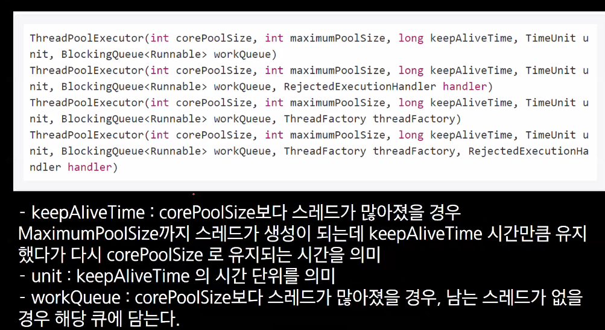
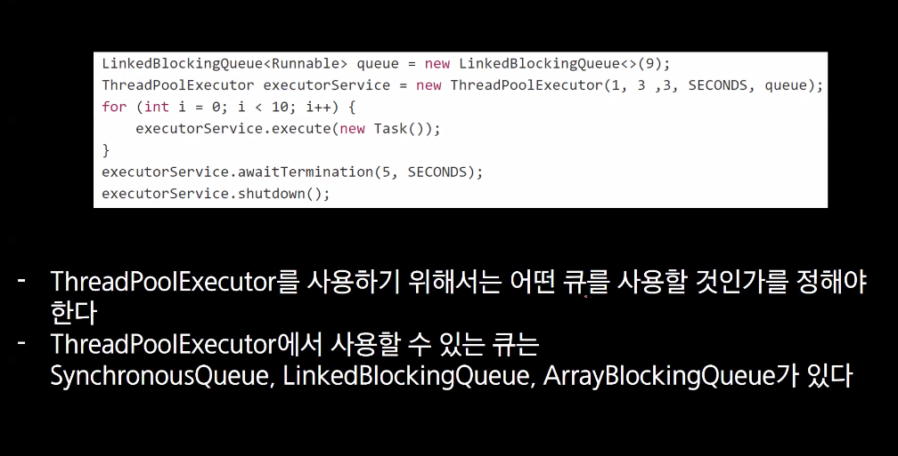

# 쓰레드 풀에 대해

---

안녕하십니까
아이들의 식습관 개선 서비스 - 피유
발표 시작하겠습니다.

본격적으로 시작하기 전에 저희가 준비한 영상 먼저 보여드리고 발표 이어가겠습니다.

영상은 재밌게 잘 보셨나요?
영상을 보신 것 처럼 저희 서비스는 피유를 통해 아이의 자립심을 키워주고 부모님의 힘듦을 덜어주는 서비스입니다.

여러분들께서도 한번쯤은 보셨을 그림이죠.
아이가 먹는동안 부모님이 아이에게 밥을 먹이는 상황이죠.
아이에게 좋지 않다는 것은 부모님도 아실겁니다. 정확한 이유는 몰라도 좋지 않다는 것은 아시겠죠.
그럼에도 이렇게 해야할 정도로 힘들다는 것입니다.
저희는 이 문제를 해결하고 싶었습니다.
적어도 아이가 식사를 하고 싶어하고 주체적으로 먹을 수 있기만 해도 좋겠다 생각했습니다.

그래서 저희의 첫 주요기능은 먹방을 따오는 것이었습니다.
아이가 먹방을 찍으면서 먹으면 식사의 주체로서 기능할 수 있겠다 생각했습니다.

하지만 문제가 하나 있었습니다.
저희 팀 중에 아무도 애기도 아니고, 육아의 경험도 없었습니다.
그래서 이 앱이 통할지 검증이 필요했습니다.

이를 위해 저희는 아동과 관련된 다양한 계층의 피드백을 받았습니다.
서비스의 타겟층이 6세 이상의 미취학 아동이므로,
해당 아동들, 그 부모님들, 유치원 선생님들, 마지막으로 아동 전문가분들의 피드백을 받으며 개발을 진행했습니다.

그렇게 저희는 현재 발표까지 6번의 릴리즈를 반복하며 개발하였습니다.

그리고 피드백으로 나온 이런 이야기를 바탕으로
4가지 주요 기능을 추가하였습니다.

첫번째로 먹방에 이은 양치 기능입니다.
아이가 하기 싫어하는 양치도 먹방처럼 아이가 재미를 느끼고 하고 싶어하도록 해주면 좋겠다는 의견을 반영하였습니다.

두번째는 튜토리얼입니다.
앱을 처음 접하는 사용자도 각 버튼의 기능과, 특히 먹방과 양치의 설명과 사용 가능한 모션을 설명하도록 했습니ㅏㄷ.

세번째는 알림입니다.
올바른 식습관에는 규칙적인 식사도 있기에,
정해둔 식사시간이 되면 피유가 배고파하고,
이를 알림으로 사용자에게 알렸습니다.

마지막으로 모션인식의 정확도 개선에 대한 이야기가 가장 많았습니다. 이것도 정확도를 높였습니다.

자세한 기능은 시연과 함께 설명드리겠습니다.

---

 시연

---

